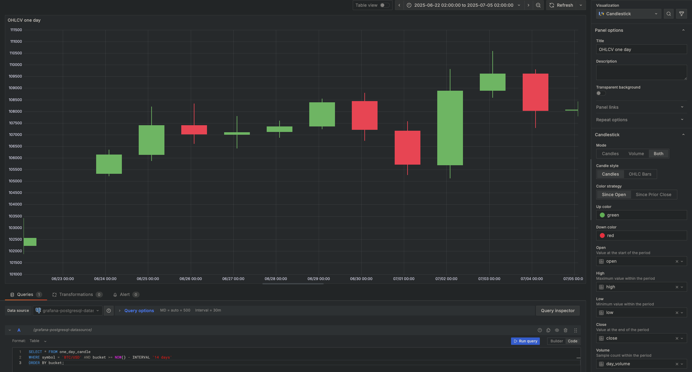

# Analyze Financial Tick Data with TimescaleDB

Efficiently convert raw, real-time cryptocurrency data into insightful candlestick views using TimescaleDB hyperfunctions and continuous aggregates.

---

## Why Use Hyperfunctions?

TimescaleDB provides built-in **hyperfunctions**, making it easier to:

- ✅ Aggregate large volumes of financial data
- ✅ Generate candlestick charts with fewer SQL lines
- ✅ Optimize query performance for real-time dashboards

Key hyperfunctions you'll use:

| Function          | Purpose                                  |
| ----------------- | ---------------------------------------- |
| `time_bucket()`   | Groups data into fixed time intervals    |
| `FIRST()`         | Captures the opening price in the bucket |
| `LAST()`          | Captures the closing price in the bucket |
| `MIN()` / `MAX()` | Finds lowest and highest price points    |

---

# Step 1: Create a Continuous Aggregate

### What is a Continuous Aggregate?

A materialized view that automatically maintains pre-aggregated candlestick data, significantly reducing query overhead for real-time analysis.

### Example: Create Daily OHLCV View

Connect to your TimescaleDB instance:

```sql
CREATE MATERIALIZED VIEW one_day_candle
WITH (timescaledb.continuous) AS
    SELECT
        time_bucket('1 day', time) AS bucket,
        symbol,
        FIRST(price, time) AS "open",
        MAX(price) AS high,
        MIN(price) AS low,
        LAST(price, time) AS "close",
        LAST(day_volume, time) AS day_volume
    FROM crypto_sample
    GROUP BY bucket, symbol;
```

✅ **Note:** You can adjust the `time_bucket` interval to other timeframes (e.g., `1 hour`, `15 minutes`).

---

# Step 2: Add an Automatic Refresh Policy

To keep your aggregates updated:

```sql
SELECT add_continuous_aggregate_policy('one_day_candle',
    start_offset => INTERVAL '3 days',
    end_offset => INTERVAL '1 day',
    schedule_interval => INTERVAL '1 day');
```

✅ This refreshes the last 2 days' worth of data every 24 hours.

---

# Step 3: Query the OHLCV Data

Example: Retrieve 14 days of Bitcoin candlestick data:

```sql
SELECT * FROM one_day_candle
WHERE symbol = 'BTC/USD'
AND bucket >= NOW() - INTERVAL '14 days'
ORDER BY bucket;
```

### Sample Output:

| bucket              | symbol  | open    | high    | low     | close   | day\_volume |
| ------------------- | ------- | ------- | ------- | ------- | ------- | ----------- |
| 2022-11-24 00:00:00 | BTC/USD | 16587   | 16781.2 | 16463.4 | 16597.4 | 21803       |
| 2022-11-25 00:00:00 | BTC/USD | 16597.4 | 16610.1 | 16344.4 | 16503.1 | 20788       |
| 2022-11-26 00:00:00 | BTC/USD | 16507.9 | 16685.5 | 16384.5 | 16450.6 | 12300       |

---

# Step 4: Visualize OHLCV Data in Grafana

## Setup:

- ✅ Ensure your TimescaleDB is added as a **Data Source** in Grafana
- ✅ Grafana is accessible (e.g., [http://localhost:3000](http://localhost:3000))

### Creating the Candlestick Chart:

1. Go to **Dashboards → New Dashboard → Add a new panel**
2. Select **Candlestick** from the visualization options
3. Click **Edit SQL** and paste your OHLCV query
4. In the **Format as** dropdown, select `Table`
5. Customize your table and chart appearance
6. Click **Apply** to save your visualization

---

# Grafana Candlestick Chart Preview



---
